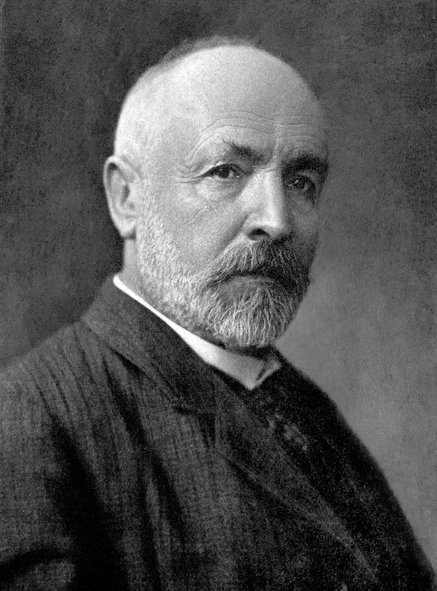
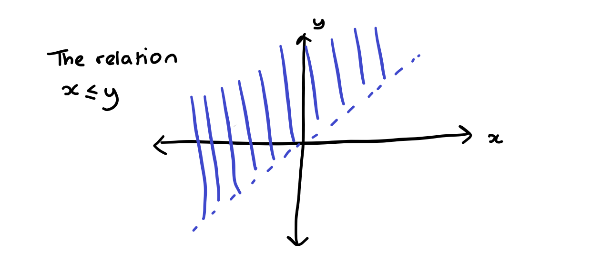

# Sets and Functions

## What is a set?

We begin with sets which are one of the basic objects of mathematics. Set theory becomes very complicated very quickly when you begin to explore the subtleties. We will discuss some of the pitfalls and paradoxes in a non-examinable section later but first we focus on when things are simple.

::: {.definition name="set"}

A *set* is a collection of mathematical objects.

:::

To make sense of this definition we need to consider some examples of things that are and are not sets.

::: {.example}

The function \(y = x^2, x \in \mathbb{R} \) is *not* a set (it's a function as we wrote). However we can form a *set* of the form \[ \{(x,y)\,:\,  x \in \mathbb{R}, y \in \mathbb{R}, y=x^2 \}.  \] 

:::

::: {.example}

The natural numbers \(\mathbb{N} = \{0,1,2, 3, 4, \dots\}\) is a set. We can see in this and the previous example that you can often recognise sets because they have curly brackets around them. However, this is not foolproof. We can write this set as \(\mathbb{N}\) and there are no curly brackets.

If you haven't seen it before remember this notation for the natural numbers. It will come up a lot!

This example also has another bit of common mathematical notation in its. The set of three dots at the end of the sequence of numbers. This indicates that the sequence will continue as you would expect it to. 

:::

::: {.example}

Sets can also have a finite number of elements. For example the following set \(\{12\}\) which contains only the integer 12. As with the first example with a function, we make a distinction between the object which is the integer 12 and a set that contains only the integer 12.

:::

::: {.example}

All the examples of sets above involve mathematical objects which are numbers (or pairs of numbers in the first example). We aren't limited to this. We might consider the set of all polynomials with integer coefficients (where all the elements are functions) or the set of all sequences of real numbers tending to zero (where all the elements are sequences). You can also consider sets with a mixture of different types of elements. e.g. 
\[ \{ 4, (\pi, \pi^2), \{1/n \,:\, n \in \mathbb{N}, n \neq 0 \}, \mbox{the function}\, f(x) = x^2\}.  \] Here notice that one of the elements of this set is a set itself. This is perfectly possible.

:::


We need to be able to talk and write about sets. We often give sets names (usually a letter) and we write 

\[ A = \{1,2,7\}.  \]

We then want to be able to say whether something is or isn't in the set so we write
\[ 1 \in A  \] to mean \(1\) is in the set \(A\) or \(1\) is an element of the set \(A\). We also write
\[ 3 \notin A \] to mean that \(3\) is not an element of the set \(A\) or that 3 isn't in \(A\).

::: {.definition}

There are some important sets which have their own symbols and names. You have probably met them before:

- The natural numbers, \(\mathbb{N}= \{1,2,3,\dots\}\),

- The integers, \(\mathbb{Z} = \{ \dots, -3, -2, -1, 0, 1, 2, 3, \dots \}\),

- The rationals, \(\mathbb{Q} = \{p/q \,:\, p \in \mathbb{Z}, q \in \mathbb{N}\}\),

- The real numbers, \( \mathbb{R} = (-\infty, \infty)\),

- The complex numbers, \(\mathbb{C} = \{x+iy \,:\, x \in \mathbb{R}, y \in \mathbb{R}\}\) where \(i\) is the complex unit.

:::


::: {.definition name="equality of sets/axiom of extension"}

Two sets are equal (the same) if they have exactly the same elements. We call this the axiom of extension. We can write it in formal language as: if for every \(x \in A\) we have \(x \in B\) and for every \(y \in B\) we have \(y \in B\) then \(A=B\).

:::

::: {.remark}

It might seem obvious at this point that any two sets with the same element are the same. However there are two important ways this comes up. 

In a proof we might write a set in two very different ways for example \( [0,\infty) = \{ x \in \mathbb{R} \,:\, \mbox{there exists}\, y \in \mathbb{R}\, \mbox{s.t.} y^2 = x\}\).

We might end up writing a set in a way that means some element appears in the representation multiple times e.g. \( \{0\}\) and \(\{0, 0\}\). The axiom of extension makes it clear that these are both the same set. It also tells us that there aren't multiple different sets containing only the element \(0\) there is just one the set \(\{0\}\).

:::

At this point it is useful to introduce some notation that you may or may not have seen before. We will talk about this notation more thoroughly in the section on proof. In my opinion it is useful to see all this notation a bit before we think about it too thoroughly.

::: {.definition}

There are several shorthand notations used in maths and particularly in logic. Some are more common than others and it is always okay and often wise not to overuse symbols. We might use the following:

-We use the symbol \(\forall\) as a shorthand for the phrase *for every* or *for all*. 

-We use the symbol \(\exists\) to mean *there exists* or *there is at least one*.

-We use the symbol \(\Rightarrow\) to mean *implies* and (much less often) the symbol \(\Leftarrow\) to mean *is implied by*.

-We use the symbol \(\Leftrightarrow\) to mean *if and only if* which we also sometimes abbreviate to iff. If and only if is a common phrase in pure maths but it might sometimes be easier to say *exactly when* to mean the same thing.

:::

Using this we can write the axiom of extension as 
\[ \forall A \forall B ( (x \in A \Leftrightarrow x \in B) \Leftarrow (A=B)).   \] Which is a good illustration of why its often better to use words!

Given that sets are defined by their elements we sometimes need to consider that set that doesn't have any elements at all.

::: {.definition name="the empty set (Axiom)"}

There exists a set which contains no elements. We call this the *empty set* and write it with the symbol \(\emptyset\).

:::

::: {.remark}

Here if you've been paying attention you'll notice that \(\emptyset \neq \{\emptyset\}\). The first contains no elements, the second contains one element which is the empty set. You can also have \(\{\emptyset, \{\emptyset\}\}\) and \(\{\emptyset, \{\emptyset\}, \{\{\emptyset\}\}\}\) and so on if you would like to reassure yourself that there exists a set containing $k$ elements for any $k \in \mathbb{N}$ but you are unconvinced of the existence of the natural numbers. (If you are in this position you might be Bertrand Russell.)

:::

## Subsets

You might be interested in looking at only part of a set. This is called a subset.

::: {.definition name="Subset"}

If \(A\) and \(B\) are sets and for every \(x \in A\) we have that \(x \in B\) then we say \(A\) is a *subset* of \(B\) which we write
\[ A \subset B.  \]


```{r echo=FALSE, fig.cap="Picture showing A as a subset of B with sets indicated by circles"}

```

:::

::: {.example}

 - \(1\) is *not* a subset of \(\{1\}\).
 - The even numbers are a subset of \(\mathbb{N}\).
 - \(\{1\}\) is a subset of \(\mathbb{N}\).
 - \( \{1\}\) is *not* a subset of \(\{\{1\}\}\).

:::

::: {.remark}

Sometimes when you are writing you wish to specify the set and the subset in a different order. We write \( B \supset A \) and this expresses exactly the same information as \(A \subset B\). When we read the expression \(B \supset A\) we say \(B\) contains \(A\) or \(B\) is a superset of \(A\).

:::

The following is also always true

::: {.lemma}

For any set \(A\) we have

- \(\emptyset \subset A\),

- \( A \subset A\)

:::

::: {.proof}

Remember to show that \(B \subset A\) we need to show that for every \(y \in B\) we have that \(y \in A\).

For the first statement since there are no elements of the empty set so absolutely any statement about every element of the empty set is true.

For the second statement if \(x \in A\) then tautologically \(x \in A\) so we have \( A \subset A \).

:::

Following from this we have

::: {.lemma}

For two sets \(A, B\) the following are equivalent:

1. \(A = B\),

2. \(A \subset B\) and \(B \subset A\).

:::

::: {.proof}

Exercise!

:::

::: {.definition}

We call a set which contains only one element a *singleton set*.

:::

We also define some notation 

::: {.definition}

We write \([[n]]= \{ k\in \mathbb{N}, k \leq n\}\).

:::


## Power sets and specification

::: {.definition name="Power set (axiom)"}

Given a set \(A\) there exists another set \(\mathcal{P}(A)\) called the *power set* of \(A\) which is the set of all possible subsets of \(A\).

:::

::: {.example}

The power set of \(\{0,1,2\}\) is
\[ \{ \emptyset, \{0\}, \{1\}, \{2\}, \{0,1\}, \{0,2\}, \{1,2\}, \{0,1,2\}\}.  \]

:::

::: {.definition name="specification (axiom)"}

*Specification* is a way of constructing subsets of a set (we've done this a lot already). Suppose \(P(A)\) is a property that an element \(x\) of \(A\) could have. Then we can define the set 
\[ B = \{ x \in A \,:\, P(A)\}.  \] 

:::

The *axiom of specification* is the set theory axiom positing that such a set exists. In this we would need a more precise notion of what a property is.

::: {.example}

The very first set we defined was defined using specification
\[ \{(x, y)\,:\, x \in \mathbb{R}, y \in \mathbb{R}, y=x^2\}.  \]

:::


## Functions

::: {.definition name="function"}

A function is comprised of three objects, a domain \(A\) which is a set, a co-domain \(B\) which is another set and a rule \(f\) which assigns an element \(f(x) \in B\) to each element \(x\) of \(A\). 

We write \(f: A \rightarrow B\).

:::

::: {.remark}

This is a slightly informal definition. This is because we don't want to create an axiom saying functions exist. We are going to build functions out of more fundamental objects soon but first we want to have a useable definition.

:::

::: {.example}

\(f(x) = x^2 : \mathbb{R} \rightarrow \mathbb{R}\) is a function and technically \(f(x) = x^2: \mathbb{R} \rightarrow [0,\infty)\) is a different function.

:::

A function can only take one value so we have to be careful when dealing with things like square roots. Similarly a function needs to take exactly one value so we also need to make sure it is defined everywhere.

::: {.definition}

If \(f: A \rightarrow B\) is a function then if \(y = f(x)\) we call \(y\) the *image* of \(x\) under \(f\). We also call \(x\) a *preimage* of \(y\) under \(f\).

Notice that an element of \(X\) can have only one image but an element of \(Y\) can have multiple or zero preimages.

:::

::: {.definition}

The identity function on \(A\) is written \(Id_A : A \rightarrow A\) and is defined by \(Id_A(x)=x\).

:::

::: {.definition name="restriction to a subset"}

Suppose that \(A\) and \(B\) are sets and \(f : A \rightarrow B\) is a function, and suppose further that \(C \subset A\). Then we can define a new function called the restriction of \(f\) to \(C\) which we write \(f|_C\). This is a function with domain \(C\) and codomain \(B\) and for \(x \in C\) we have \(f|_C(x) = f(x)\).

:::

## Properties of functions

::: {.definition name="injectivity"}

A function \(f:A\rightarrow B\) is called *injective* if \(f(x)=f(x')\) implies that \(x=x'\). That is to say there are no two elements of \(X\) where \(f(x)\) takes the same value, or \(y\) has at most one preimage under \(f\).

:::

::: {.example}

The function \(f: \mathbb{R} \rightarrow \mathbb{R}\) defined by \(f(x) =x^2\) is not injective because for every \(y>0\) there are two possible values of \(x\) such that \(x^2 = y\).

However, the function \(f: [0, \infty) \rightarrow \mathbb{R} \) is injective because now for every \(y\geq 0\) there is exactly one \(x\) such that \(x^2=y\) and for every \(y <0 \) there are no elements \(x\) in the set such that \(x^2 = y\) (so for any \(y\) in the codomain there is never more than one element \(x\) in the domain so that \(x^2 = y\)).

:::

```{r echo=FALSE, fig.cap="example of an injective function"}

```


::: {.definition name="surjectivity"}

A function \(f: A \rightarrow B\) is called *surjective* if for every \(y \in B\) there exists \(x \in A\) with \(f(x)=y\). That is to say the function \(f\) hits every element of the set \(B\) or that \(y\) has at least one preimage under \(x\).

:::

::: {.example}

The function \(f:\mathbb{R} \rightarrow \mathbb{R}\) defined by \(f(x) = x^2\) is not surjective because for \(y<0\) there is no element \(x\) of the domain so that \(x^2=y\).

However, the function \(f: \mathbb{R} \rightarrow [0,\infty)\) is surjective because for every element \(y\) of the codomain we have some \(x\) in the domain with \(x^2 =y\).

:::

```{r, echo=FALSE, fig.cap="example of a surjective function"}
knitr::include_graphics("surjective.png")
```


::: {.definition name="bijectivity"}

A function is called *bijective* if it is both *surjective* and *injective*. 

:::

::: {.remark}

Bijective functions are often called matchings because if \(f: A \rightarrow B\) is a bijection then we *match* every element of \(A\) with an element of \(B\).

:::

```{r, echo=FALSE, fig.cap="example of a bijective function"}
knitr::include_graphics("bijective.png")
```

## Cardinality

If \(f: A \rightarrow B\) is a bijection then that tells us something important about the relationship between \(A\) and \(B\).

::: {.definition name="Cardinality"}

We say that \(A\) and \(B\) have the same *cardinality* (informally the same size) if there exists a bijection between \(A\) and \(B\). We often write \(|A| = |B|\).

:::

::: {.definition name="Finiteness"}
Cardinality allows us to give a rigorous notion for a set to be *finite*/have a finite number of elements. 

Given a set \(A\), if there is some natural number \(n\) such that \(|A|=|[[n-1]]|\) then we say \(A\) has size \(n\).

If \(A\) has size \(n\) for some \(n\) then we say \(A\) is finite.

:::

::: {.definition name="infinite"}

We say a set is *infinite* if it isn't finite.

:::

::: {.defintion name="pigeon hole principle"}

Suppose \(A\) and \(B\) are finite sets with \(|A| > |B|\) and \(f: A \rightarrow B\) is a function then there exists some \(b \in B\) for which there are at least two elements \(a_1,a_2\) of \(A\) for which \(f(a_1)=f(a_2)=b\).

The name for this fact comes from the idea that if you have a dovecote with \(n\) holes and you have more than \(n+1\) pigeons then however you arrange the pigeons at least one hole must contain more than one pigoen.

:::

::: {.lemma}

Suppose that \(A,B\) are sets and \(B\) is finite.

- If there exists an injection \(f: A \rightarrow B\) then \(A\) is finite.

- If there exists a surjections \(g: B \rightarrow A\) then \(A\) is finite.

:::

::: {.proof}

If \(B\) is finite then there is a bijection between \(B\) and some \([[n]]\) and so composing \(f\) and this bijection gives an injection form \(A\) to some subset of \([[n]]\). Let us call this injection \(j\). Now let us create a bijection from \(A\) to some \([[m]]\) as follows. The image of \(j\) is \(\{j_0, \dots, j_m\}\) so let us map \(j^{-1}(j_k)\) to \(k\) for \(k=0,\dots, m\). This shows that \(A\) is finite.

Now considering the second point. We can choose a right inverse to \(g\) which we call \(h\). This will be an injection since \(g\) is a function so the first point proves that \(A\) is finite also in this case.

:::


::: {.theorem name="Cantor's Theorem"}

Let \(A\) be a set and \(f: A \rightarrow \mathcal{P}(A)\) then \(f\) cannot be a surjection.

You could also say: there is no surjection between a set and its power set.

:::

::: {.remark}

One implication of this theorem is that a set cannot be the same size as its power set. This is obvious for finite sets; if \(|A|=n\) then \(|\mathcal{P}(A)|= 2^n\) but it isn't clear for infinite sets.

:::

::: {.proof}

We notice that for every \(x \in A\) we have \(f(x)\) which is a subset of \(A\). This brings up two possibilities we could have \(x \in f(x)\) or \( x \notin f(x)\). We can form a set \(C\) by writing
\[ C = \{ x \in A\,:\, x \notin f(x)\}.  \]

Now suppose for contradiction that \(f\) is surjective. This implies that there exists some \(c \in A\) such that \( f(c) = C\).

Now there are two possibilities. 

1. \( c \in C\) which is a contradiction because we defined \(C\) to be the set of \(x\) for which \(x \notin f(x)\).

2. \( c \notin C\) which is also a contradiction because then if \(C\) is the set of all \(x\) for which \(x \notin f(x)\) so should contain \(c\).

Therefore we have a contradiction to \(f\) being surjective.

:::

```{r echo=FALSE ,out.width="30%", fig.cap="A picture of Cantor"}

```

Cantor was one of the pioneers of the foundations of mathematics and in particular set theory. His work was astonishingly controversial at the time. One of the implications of Cantor's theorem which we haven't explored is the existence of an infinity which is *larger* in some sense than the infinity that is the cardinality of the natural numbers. Some theologians believed this as a step towards pantheism. He was also described as a "corrupter of youth". 


::: {.remark name="non-examinable"}

The proof of Cantor's theorem is is strongly related to *Russel's paradox". Let us consider the set \(R= \{ \mbox{all sets}\, x \,\mbox{such that} \, x \notin x \}\) then the question is whether \(R \in R\)? 

It becomes clear from this that we cannot define the set \(R\) so we do not want to build an axiom set which would allow us to define something like \(R\).

:::


## Ordered pairs and Cartesian products

When we think about functions we often think about the graph of a function. Therefore is is useful to enhance our set theory in a way that allows us to talk about graphs.

::: {.definition name="ordered pairs"}

If we have two sets \(X\) and \(Y\) and \(x \in X, y \in Y\) then we can form an ordered pair of these two elements that we write \((x,y)\). 

:::

::: {.remark}

Here we say *ordered* pair because the order matters. So \((1,2) \neq (2,1)\). This is different to how sets behave where \(\{1,2\} = \{2,1\}\). Also unlike setes we keep repeats. We can have a pair \(x,x\) if \( x \in X\) and \(x \in Y\) and this is different to the element \(x\). 

:::

::: {.definition name="cartesian product"}

Given two sets \(X\) and \(Y\) we can form a new set \(X \times Y\) called the *Cartesian product* of \(X\) and \(Y\) and defined by 
\[ X \times Y = \{ (x,y) \,:\, x \in X, y \in Y\}.  \]

:::

::: {.remark}

We have a special notation for the Cartesian product between a set and itself. We write
\[ X^2 = X \times X,  \] and
\[ X^n = X \times X^{n-1}.  \] You will have probably seen this before e.g. \( \mathbb{R}^d\).

:::


## Graphs and a better definition of functions


Relations are an important mathematical object that you might not have thought about before. At first they seem quite similar to functions but they can appear in a very different settings. Since this is a section a about functions we are just going to talk enough about relations to give a better definition of a function and then return to them later.


::: {.definition name="Graphical relations"}

A *graphical relation* is formed of three objects

- A domain \(X\)

- A codomain \(Y\)

- A subset \(G \subset X \times Y\) which saitsfies that for every \(x \in X\) there exists exactly one \(y \in Y\) such that \((x,y) \in G\).

If \((x,y) \in G\) we write \(xGy\).

:::

::: {.example}

The relation defined by \((x,y) \in G \Leftrightarrow x \leq y\) is not graphical from \(\mathbb{R}\) to itself because for every \(x\) there are many \(y\) with \(y \leq x\).

```{r, echo=FALSE, fig.cap="A picture of the less than relation on the reals"}

```

The relation defined by \((x,y) \in G \Leftrightarrow x=y^2\) is not graphical from \(\mathbb{R}\) to itself because if \(x\) is negative then it isn't the square of any real number so there are no \(y\)s with \(x G y\), and also because for \(x \geq 0\) there are two \(y\)s with \(x=y^2\).


```{r, echo=FALSE, fig.cap="A picture of the is the square of relation"}

```

The relation defined by \((x,y) \in G \Leftrightarrow x=y^3\) on \(\mathbb{R}\) *is* graphical because for every \(x \in \mathbb{R}\) there is exactly one \(y \in \mathbb{R}\) such that \( x=y^3\).


```{r, echo=FALSE, fig.cap="A picture of the is the cube of relation"}

```

:::


Using this we can give a better definition of a function

::: {.definition name="function"}

Given a graphical relation \((x,Y,G)\) we can define a function \(f\) with domain \(X\) and co-domain \(Y\) by setting \(f(x) = y\) for the unique \(y\) such that \((x,y) \in G\).

:::

::: {.remark}

It is interesting *and subtle* to think about why this is a more satisfactory definition of a function. People who worked on the foundations of mathematics wanted to build all mathematical objects from sets using a fairly small set of axioms.

We have done something in this direction, but starting only with sets and axioms it would take a very long time to define everything we need for this course. It is also challenging and not to everybodies taste. Here we have skipped some steps, hidden some subtleties, added axioms to make it simpler etc. For example, in the axiom of separation we have not really defined what we mean by a property, and we have used the natural numbers without defining them starting from sets. 

Most of the time when we've introduced new axioms, we are asserting that some set exists (e.g. a power set, union, etc.). If we wanted to add an axiom saying functions exist/make sense this would mean adding an axiom that doesn't just say "another kind of set exists" it would say "a completely new kind of object exists" and this is in some sense very unsatisfactory. Therefore, this later more formal definition of function is *better* because it allows us to say what a function is using only concepts about sets and subsets.

:::


