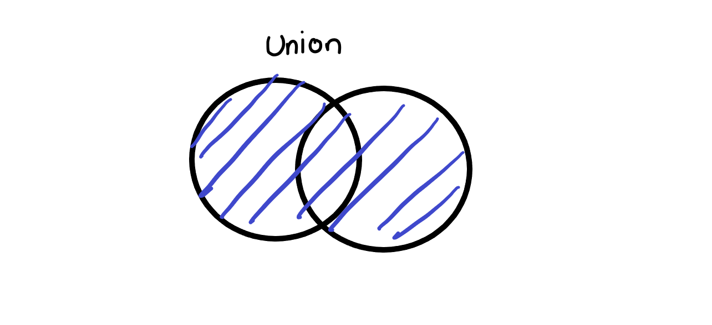
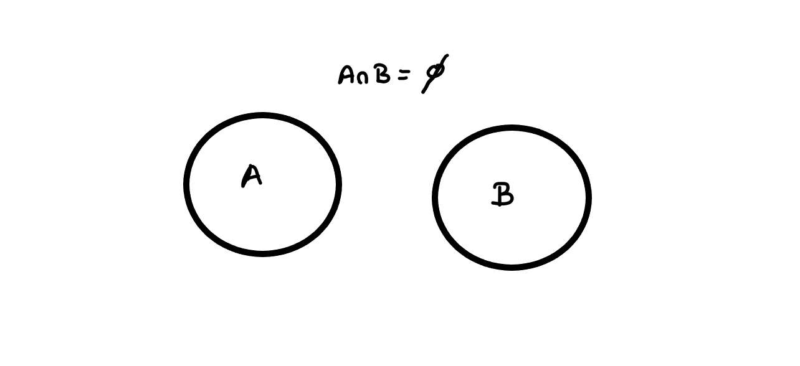
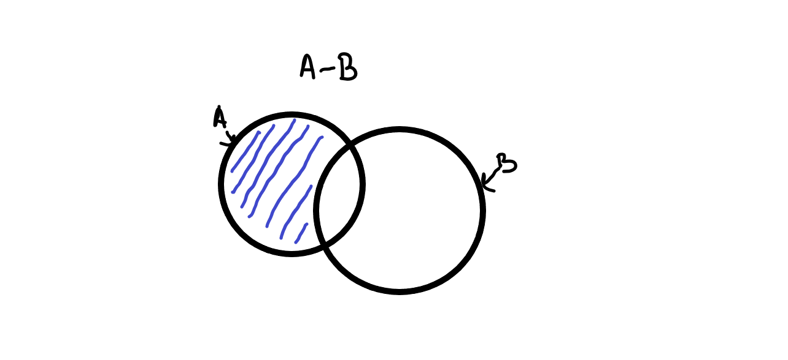
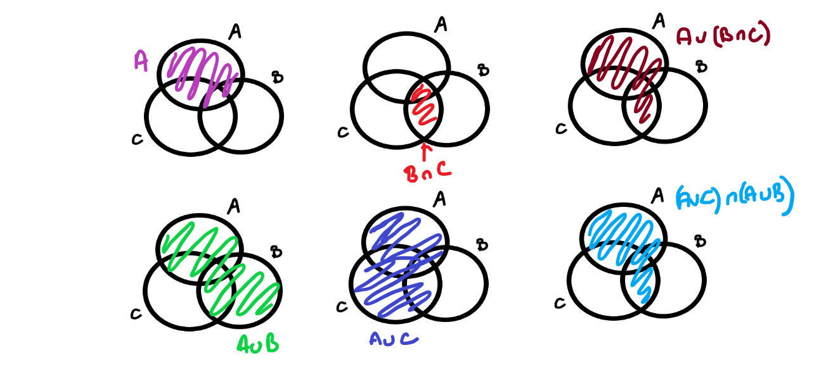
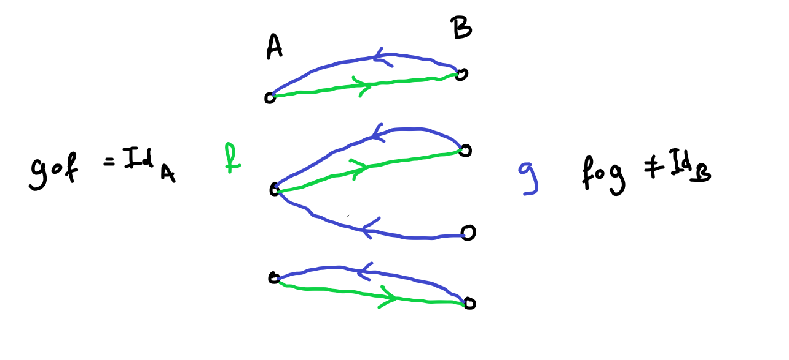
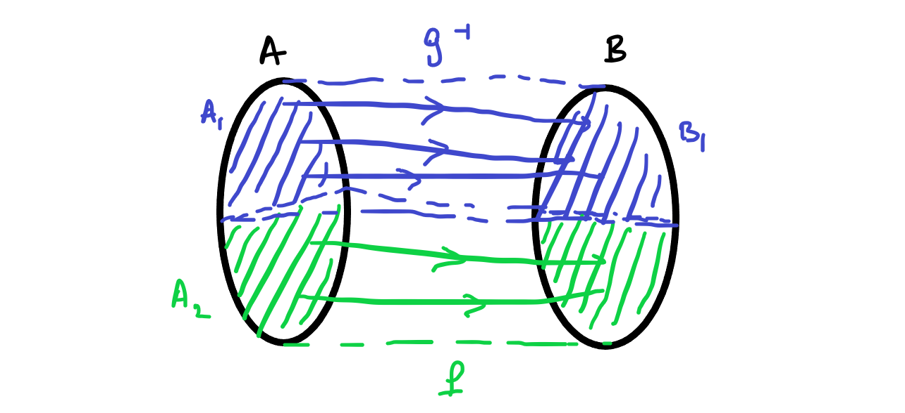

# Operations on sets and functions

## Set operations

We have already seen a few ways of making new sets from old like specification or taking Cartesian products. We are now going to look at some common *set operations* which allow us to make lots of new sets.

::: {.definition name="union"}

The union of two sets \(A\) and \(B\) is set containing all the elements that are in \(A\) or \(B\) (or both). We write it \(A\cup B\).


```{r, echo=FALSE, fig.cap="picture of a union of two sets, sets represented as overlapping circles"}

```

We don't just have to take unions over pairs of sets. In fact we can take a union over almost any collection of sets. Formally, suppose that \(C\) is a set all of whose elements are sets then we can define a new set
\[ \bigcup C = \{ x \,:\, \exists S \in C\, \mbox{s.t.}\, x \in S\}.\]
:::

::: {.remark}

In practice most unions we take over larger collections of sets won't be written like they are in the formal definition. It is common so see a union taken of a sequence of sets \(A_1, A_2, A_3, \dots\) then we write \( \bigcup_n A_n\) to be the union of all these sets.

:::

::: {.example}

\[ \{1,2,3\} \cup \{ 1,2, 4\} = \{1,2,3,4\}.\]

:::

::: {.example}

\[ \bigcup_{n \in \mathbb{N}} [[n]] = \mathbb{N}. \]

:::

::: {.lemma}

Suppose that \(A, B\) and \(C\) are sets then the following are true

- \(A \cup \emptyset = A\),

- \(A \cup (B \cup C) = (A \cup B)\cup C\),

-  \( A \cup B = B \cup A \),

- \( A \cup B = B\) if and only if \( A \subseteq B\),

- \( A \cup A = A\)


:::

Another very important *set operation* is taking intersections.

::: {.definition name="intersection"}

Given two sets \(A\) and \(B\) the *intersection* of \(A\) and \(B\) is the set containing the elements in *both* \(A\) and \(B\).


```{r, echo=FALSE, fig.cap="picture of the intersection of two sets, sets represented by overlapping circles"}
knitr::include_graphics("intersection.png")
```

As with unions, we don't have to do this with a pair of sets. If \(C\) is a set all of whose elements are sets we can write
\[ \bigcap C = \{ x \,:\,  x \in S \, \forall \, S \in C\}.  \]

An important piece of notation is that if \(A\) and \(B\) are sets with \(A \cap B = \emptyset\) then we say that \(A\) and \(B\) are *disjoint*.


```{r echo=FALSE, fig.cap="picture showing two disjoint sets"}

```

:::

::: {.remark}

Again as with unions, we will more often see this definition applied to sequences of sets using notation like
\[ \bigcap_n A_n.  \]

:::

::: {.example}

\[ \{1,2,3\} \cap \{ 1,2,4\} = \{1,2\}.\]

:::

::: {.example}

\[\bigcup_{n \in \mathbb{N}} [[n]] = {0}. \]

:::

::: {.lemma}

Given sets \(A, B, C\) the following are true

- \( A \cap \emptyset = \emptyset \),

- \((A \cap B) \cap C = A \cap (B\cap C)\),

- \( A \cap B = B \cap A \),

- \(A \cap B = B\) if and only if \( A \supset B\),

- \( A \cap A = A\).

:::

::: {.definition name="set difference"}

If \(A\) and \(B\) are sets the we define the *set difference* which we write \(A - B\) (or sometimes \( A \setminus B\)) by

\[ A - B = \{ x \,:\, x \in A, x \notin B\}.  \]

```{r, echo=FALSE, fig.cap="picture of setminus with sets represented by overlappying circles"}

```

:::

::: {.remark}

WARNING: Unlike union and intersection, set difference is not commutative.

:::

::: {.example}

\[ \{1,2,3\} - \{1,2,4\} = \{3\}, \quad \{1,2,4\} - \{1,2,3\} = \{4\}.\]

:::

## Using set operations together

There are some rules for how set operations interact with each other. Usually these are easy to remember/prove by drawing pictures or by writing out exactly what each operation means.

::: {.lemma}

Suppose that \(A, B\) and \(C\) are sets then we can distribute intersections and unions with each other in the following way

- \( A \cap (B \cup C) = (A \cap B) \cup (A \cap C)\)


```{r, echo=FALSE, fig.cap="picture of distibutivity of union"}
knitr::include_graphics("distributive1.png")
```

- \( A\cup (B \cap C) = (A \cup B) \cap (A \cup C)\)


```{r, echo=FALSE, fig.cap="picture of distibutivity of intersection"}

```


:::

::: {.proof}

These results are very straightforward to prove. We remember that that if \( x \in A \Rightarrow x \in B\) and \( x \in B \Rightarrow x \in A\) then \(A = B\).

If \( x \in A \cap (B \cup C)\) then we know \(x \in A\) and \(x \in B\) or \(x \in C\). Therefore \( x \in A\) and \(x \in B\) or \(x \in A\) and \(x \in C\) so \(x \in (A\cap B) \cup (A \cap C)\). 

The second result is proved similarly. 

As there are only 3 sets involved the pictures probably provide a clearer (and still rigorous) proof for most people. However with four or more sets it becomes impossible to draw sets with all the possible intersections, so we need to be able to use symbols too.

:::

We also have a similar result involving setminuses. 


::: {.lemma name="De Morgan's Laws"}

Suppose \(A, B\) and \(C\) are sets then the following are true

- \(A - (B \cup C) = (A-B)\cap(A-C)\),

```{r, echo=FALSE, fig.cap="picture of De Morgan's Laws 1"}
knitr::include_graphics("demorgan1.png")
```

- \(A - (B \cap C) = (A-B)\cup(A-C)\).

```{r, echo=FALSE, fig.cap="picture of De Morgan's Laws 2"}
knitr::include_graphics("demorgan2.png")
```

:::

All these operations can be understood in terms of indicator functions as well

::: {.lemma}

Given a set \(A\) and subsets \(B, C, D\) we have the following:

- \(1_{B \cap C} = 1_{B}1_{C}\).

- \( 1_{B \cup C} = 1_B + 1_C - 1_B 1_C\).

- If \(B \subset C\) then \(1_{C \setminus B} = 1_C - 1_B\).

:::

::: {.proof}

If you want to you can check these yourself. It is mainly just symbol pushing. A more exciting thing to do is try and prove De Morgan's laws or distributative laws using these facts.

:::

## Operations on functions

::: {.definition name="composition"}

Given sets \(A, B\) and \(C\) and functions \(f: A \rightarrow B\) and \(g: B \rightarrow C\) we can define a new function \(f \circ g\) from \(A\) to \(C\) by
\[ f\circ g(x) = g(f(x)).  \]


```{r echo=FALSE, fig.cap="diagram of function composition"}
knitr::include_graphics("compositiondiagram.png")
```

:::

::: {.example}


```{r echo=FALSE, fig.cap="example of function composition"}
knitr::include_graphics("compositionexample.png")
```

:::

::: {.example}

Another example would be if \(f: \mathbb{R} \rightarrow [0,\infty)\) is defined by \(f(x) = x^2\) and \(g: [0,\infty) \rightarrow [0, \infty)\) is defined by \(g(y) = \sqrt{y}\) then \(f \circ g (x) = |x|\) and is defined from \(\mathbb{R}\) to \([0,\infty)\).

:::

::: {.remark}

An important example of composition is if \(A\) is a set and \(f: A \rightarrow A\) then we can compose \(A\) with itself. We often write \(f\circ f = f^2\) and \(f^n= f\circ f^{n-1}\).

:::

::: {.lemma name="Associativity of composition"}

Composition of functions is associative. That is to say, if \(A,B,C\) and \(D\) are all sets and \(f:A \rightarrow B, g: B \rightarrow C\) and \(h: C \rightarrow D\) are all functions then
\[ f \circ (g \circ h) = (f \circ g) \circ h  \]


```{r echo=FALSE, fig.cap="picture of associativity of composition of function"}
knitr::include_graphics("compassoc.png")
```
:::

::: {.proof}

To prove this we can evaluate the functions at a given \(x \in A\).

\[f \circ (g \circ h)(x) = (g \circ h)(f(x)) = h(g(f(x))).\]

\[(f\circ g) \circ h(x) = h (f\circ g(x)) = h(g(f(x))).\]

:::

We can relate composition of functions to injectivity and surjectivity

::: {.lemma}

Suppose that \(A, B\) and \(C\) are sets and \(f: A \rightarrow B\) and \(g: B \rightarrow C\) are functions then

- If both \(f\) and \(g\) are injective then so is \(f \circ g\),

- If both \(f\) and \(g\) are surjective then so is \(f \circ g\).

:::

::: {.proof}

If both \(f\) and \(g\) are injective then given \(z \in C\) there is at most one \(y \in B\) with \(g(y)=z \) then for this \(y\) there is at most one \(x \in A\) with \(f(x) = y\) therefore there is at most one \(x \in A\) with \(f\circ g(x) = z\).

If both \(f\) and \(g\) are surjective then given \(z \in C\) there is at least one \(y \in B\) with \(g(y) = z\) and for this \(y\) there is at least one \(x \in A\) with \(f(x) = y\) therefore there is at least one \(x \in A\) with \(f \circ g (x) = z\).

:::


This next set of results is about what it means to be the *inverse of a function*. This can be a subtle and quite complicated issue.

::: {.example}

As we just saw above if \(f: \mathbb{R} \rightarrow [0,\infty)\) is defined by \(f(x) = x^2\) and \(g: [0,\infty) \rightarrow [0, \infty)\) is defined by \(g(y) = \sqrt{y}\) then \(f \circ g (x) = |x|\). So even though we think of square root and squaring as inverses of each other in this case \(f \circ g\) is not equal to the identity function.

On the other hand if \(f : [0, \infty) \rightarrow [0, \infty) \) defined by \(f(x)=x^2\) and \( g: [0,\infty) \rightarrow [0,\infty)\) is defined by \(g(y) = \sqrt(y)\) then \(f \circ g(x) = x \) so if we change the domain of \(f\) we can think for these functions as inverse to each other.

We also have that if \(f: \mathbb{R} \rightarrow [0,\infty)\) defined by \(f(x) = x^2\) and \(g: [0, \infty) \rightarrow [0,\infty)\) defined by \(g(y) = \sqrt(y)\) (as in the first part of the example) then \(g\circ f)(y) = y\). we can think of these as inverse to eachother in one order but not in the other order.

:::

::: {.definition name="left and right inverses"}

Let \(A\) and \(B\) be sets and let \(f: A \rightarrow B\) and \(g: B \rightarrow A\).

- We call \(g\) a *left inverse* of \(f\) if \(g\circ f = Id_B\),

- We call \(g\) a *right inverse* of \(f\) if \( f\circ g = Id_A\).

- We call \(g\) an *inverse* of \(f\) if it is both a left inverse and a right inverse. If an inverse exists we often write \(g = f^{-1}\).


:::

```{r echo=FALSE, fig.cap="example of a function with a right inverse but no left inverse"}

```

::: {.lemma}

Given two sets \(A\) and \(B\) and a function \(f: A \rightarrow B\), we have the following equivalences

1. \(f\) is injective if and only if \(f\) has a left inverse,

2. \(f\) is surjective if and only if \(f\) has a right inverse,

3. \(f\) is bijective if an only if \(f\) has an inverse.

:::

::: {.proof}

Let us begin with point 1. in the direction *injective* \(\Rightarrow\) *left inverse*. Injectivity means that for every \(y \in B\) there is at most one \(x \in A\) with \(f(x) = y\). So we can define a left inverse as follows: if there exists an \(x \in A\) with \(f(x)=y\) then set \(g(y) =x\). If there exists no \(x \in A\) with \(f(x)=y\) then choose an arbitrary element \(x_0 \in A\) and set \(g(y) = x_0\). This ensures that for every \(x \in A\) we have \(g(f(x))= x\).

Now point 1 in the direction *left inverse* \(\Rightarrow\) *injective*. So there exists \(g\) with \(g(f(x))=x\) for all \(x \in A\). Suppose \(f\) isn't injective then there exists \(y_0 \in B\)  and \(x_1 \neq x_2 \in A\) such that \(f(x_1) = f(x_2) = y_0\). Then we have that \(g(y_0) = g(f(x_1))= x_1 = g(f(x_2))=x_2 \) which is a contradiction. Therefore \(f\) must be injective.

Now point 2 in the direction *surjective* \(\Rightarrow\) *right inverse*. For every \(y \in B\) there exists at least one \(x\) such that \(f(x)=y\) by surjectivity. So define a function \(g\) by choosing \(g(y)\) to be equal to one of the \(x \in A\) with \(f(x) = y\). This means that \(f(g(y))= y\) so \(g\) is a right inverse to \(f\).

Now point 2 in the direction *right inverse* \(\Rightarrow\) *surjective*. So we have a function \(g\) such that \(f(g(y))=y\). So for every \(y \in B\) there exist one element in A, namely \(g(y)\), such that \(f(g(y))=y\) so \(f\) is surjective.

Now for point 3 it looks at first like we can just apply the previous results. We can in one direction. If \(f\) has an inverse then it has both a left inverse and a right inverse so by points 1 and 2 \(f\) must be both injective and surjective so it is bijective.

Now if we want to show bijectivity of \(f\) implies we must have an inverse we not that if \(f\) is bijective then for every \(y\in B\) there exists exactly one \(x \in A\) such that \(f(x) = y\) so we can define \(g(y)\) to be this unique \(x\) and this ensures that \(g(f(x))= x\) and \(f(g(y))= y\).

:::


::: {.definition name="pigeon hole principle"}

Suppose \(A\) and \(B\) are finite sets with \(|A| > |B|\) and \(f: A \rightarrow B\) is a function then there exists some \(b \in B\) for which there are at least two elements \(a_1,a_2\) of \(A\) for which \(f(a_1)=f(a_2)=b\).

The name for this fact comes from the idea that if you have a dovecote with \(n\) holes and you have more than \(n+1\) pigeons then however you arrange the pigeons at least one hole must contain more than one pigeon.

:::

::: {.lemma}

Suppose that \(A,B\) are sets and \(B\) is finite.

- If there exists an injection \(f: A \rightarrow B\) then \(A\) is finite.

- If there exists a surjections \(g: B \rightarrow A\) then \(A\) is finite.

:::

::: {.proof}

If \(B\) is finite then there is a bijection between \(B\) and some \([[n]]\) and so composing \(f\) and this bijection gives an injection form \(A\) to some subset of \([[n]]\). Let us call this injection \(j\). Now let us create a bijection from \(A\) to some \([[m]]\) as follows. The image of \(j\) is \(\{j_0, \dots, j_m\}\) so let us map \(j^{-1}(j_k)\) to \(k\) for \(k=0,\dots, m\). This shows that \(A\) is finite.

Now considering the second point. We can choose a right inverse to \(g\) which we call \(h\). This will be an injection since \(g\) is a function so the first point proves that \(A\) is finite also in this case.

:::


Lastly in this section we have a deeper theorem whose proof is more complicated that those we have encountered before.

::: {.theorem name="Cantor-Schoeder-Bernstein"}

Let \(A, B\) be sets and let \(f: A \rightarrow B\) be an injection and \(g: B \rightarrow A\) be an injection. Then there exists a bijection \(h\) between \(A\) and \(B\).

:::

::: {.proof name="NONEXAMINABLE"}

Let us call \(C = f(A) \subset B\) and \(D = g(B) \subset A\). Since \(f\) and \(g\) are injective we can define \(f^{-1}:C \rightarrow A\) and \(g^{-1}: D \rightarrow B\).

So we end up with two bijective functions going from parts of \(A\) to parts of \(B\) namely \(f: A \rightarrow D\) and \(g^{-1}: C \rightarrow B\)

```{r echo=FALSE, fig.cap="Our two functions going from A to B"}
knitr::include_graphics("CBS1.png")
```

Now we want to create \(h\) from both \(f\) and \(g^{-1}\). To do this we want to split \(A\) into two sets \(A_1\) where we use \(f\) to get to points in \(B\) and \(A_2\) where we use \(g^{-1}\) to get to points in \(B\).

```{r echo=FALSE, fig.cap="A picture of how we want to split up A"}

```

Our challenge is to find suitable sets \(A_1\) and \(A_2\). We can see that \(A_2 \subset C\) since \(g^{-1}\) must be defined on \(A_2\). We can also see that in some situations \(A_2\) could be the whole of \(C\) because doing this we could hit some elements of \(D\) twice and break the injectivity.

Let us write \(i = f\circ g\). This function is injective on \(A\) and it's range is \(C\). We can similarly define \(j = g \circ f\) which will also be injective on \(B\) and whose range is \(D\).

Now let us create some sequences of sets \( C_0 = A, C_1 = i(A), C_2=i(C_1), \dots, C_n = i(C_{n-1}), \dots\) and \(D_0 = B, D_1= j(B), \dots, D_n = j(D_{n-1}), \dots \). Then let us define \(C_\infty = \bigcap_n C_n\) and \(D_\infty = \bigcap_n D_n\). So \(C_\infty\) are points which will keep being in the range of \(i^n\) for any \(n\) and \(D_\infty\) similarly. 

We make the following claim: 
\begin{align}
g(y) \in C_\infty &\Leftrightarrow y \in D_\infty, \\
f(x) \in D_\infty &\Leftrightarrow x \in C_\infty.
\end{align}


Let us call 
\[ A_1 = \{ x \in A \,:\, x \notin C_\infty, \mbox{for the least} \,n \, \mbox{s.t.}\, x \notin C_n, i^{-n+1}(x) \notin C\} \]
and
\[ A_0 = \{ x \in A \,:\, x \notin C_\infty, \mbox{for the least} \, n \, \mbox{s.t.}\, x \notin C_n, i^{-n+1}(x) \in C, g^{-1}(i^{-n+1}(x)) \notin D \}.\] Then \(A_1\) and \(A_2\) are disjoint.

Similarly,

\[ B_1 = \{y \in B\,:\, y \notin B_\infty, \mbox{for the least}\, n \, \mbox{s.t.}\, y \notin D_n, j^{-n+1}(y) \notin D\}\]
and
\[ B_0 = \{y \in B\,:\, y \notin B_\infty, \mbox{for the least}\, n \, \mbox{s.t.}\, y \notin D_n, j^{-n+1}(y) \in D, f^{-1}(j^{-n+1}(y)) \notin C\}.\] The sets are also disjoint.

Now we have our second claim:

- \(x \in A_1\) if and only if \(f(x) \in B_0\)

- \(x \in A_0\) if and only if \(g^{-1}(x) \in B_1\)


This second claim shows that 

- \(f|_{A_1} : A_1 \rightarrow B_0 \) is a bijection and

- \(g^{-1}|_{A_0} : A_0 \rightarrow B_1 \) is a bijection.

```{r echo=FALSE, fig.cap="A picture of the bijections we've constructed"}
knitr::include_graphics("CBS3.png")
```

Now we have deconstructed into different bijections we can define \(h\) by saying 
\[ h(x) = \left\{ \begin{array}{cr} f(x) & x \in A_1 \cup A_\infty\\ g^{-1}(x) & x \in A_0 \end{array} \right.  \]

:::
