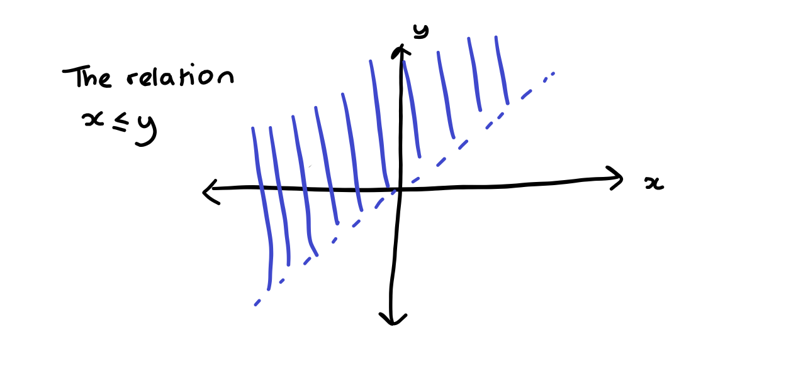
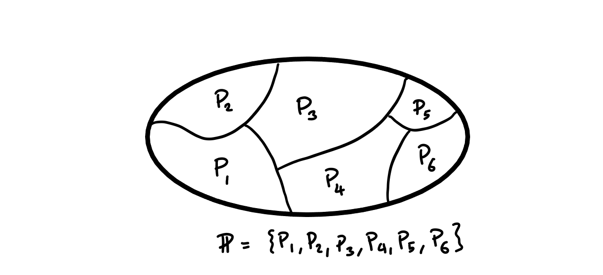

# Relations

Before we define them formally let us look at some examples.

For a generic relationship \(R\) we write \(x\) and \(y\) are related under \(R\) by \(x R y\). Here the ordering matters as you can see in the example.

::: {.example}

We can relate two real numbers \(x\) and \(y\) with the relationship *is less than*. So we can write \(xR y\) if \( x \leq y\).

:::

::: {.example}

Is equal to is also a relation. This can be more complicated that just trivially equating elements of the same set. For example we might want to write a relation between \(\mathbb{N}\) and \( \mathbb{R}\) by equating integers with their counterpart in the natural numbers. 

:::

::: {.remark}

Something that isn't a relation but might seem similar is a *property*. So for example the statement \(3\) is a prime number is just talking about a property that may or may not hold for the integers. We can come up with a relation to the set \(\{1\}\) by saying \(n R 1\) if and only if \(n\) is prime.

:::

The formal definition of a relation is as follows

::: {.definition name="relation"}

A relation consists of three parts

- A set \(X\) called the *domain*,

- A set \(Y\) called the *co-domain*

- A subset of \(X \times Y\) often given the name \(R\).

Using the notation from before we write \(x R y\) iff \((x,y)\) is in the subset of \(X \times Y\) defining the relation.

:::

We can represent the relation *is less than* with a picture as we saw in week 1.

```{r echo=FALSE, fig.cap="A picture of the relation less than"}

```

## Equivalence relations, Equivalence classes and Quotients

In this section we look at some particular properties a relation can have when it relates elements of the same sets. That is to say, we are interested in a set \(X\) and a relation \(R\) on \(X\) defined by a subset of \(X^2\).

::: {.definition name="reflexivity"}

We call a relation, \(R\), on \(X\) *reflexive* if \(x R x\).

:::


::: {.example}

The relation defined by \(<\) is *not* reflexive; the relation defined by \(\leq\) *is* reflexive.

:::

::: {.definition name="transitivity"}

We call a relation \(R\) on \(X\) *transitive* if \(x R y\) and \(y R z\) implies that \(x R z\).

:::

::: {.example}

Both the relations given above \(<,\leq\) are transitive but a relation like *is the square of* is not.

:::

:::{.definition name="symmetric"}

A relation \(R\) on \(X\) is *symmetric* if \(x R y\) implies that \(y R x\).

:::

::: {.example}

The relation on \(\mathbb{R}\) given by \(xR y\) if an only if \(|x-y|=1\) is symmetric.

The relation on \(\mathbb{R}\) given by \(x R y\) if and only if \(x-y=1\) is not symmetric.

:::

::: {.definition name="equivalence relations"}

A relation on \(X\) is called an *equivalence relation* if it is reflexive, symmetric and transitive. We often denote equivalence relations with \(\sim\) rather than \(R\).

:::

::: {.remark}

Equivalence relations are a very important object in mathematics. We will see more about splitting up sets using equivalence relations soon. Equivalence relations are supposed to represent the properties of equality.

:::

::: {.example}
- The relation defined by \(x \sim y\) if and only if \(x-y \in \mathbb{Q}\) is and equivalence relation.

- The relation defined by \(x \sim y\) if and only if \(x=y\) is an equivalence relation. 

:::

We can use equivalence relations to divide sets into chunks. In order to talk about this let us first give a proper definition of what it would mean to define a set into chunks.

::: {.definition name="Partitions"}

Given a set \(X\) a partition of \(X\) is a subset \(\mathbb{P}\) or \(\mathcal{P}(X)\) (so a set of subsets of \(X\)) satisfying the following:

- If \(P, Q\) in \(\mathbb{P}\) and \(P \neq Q\) then \(P \cap Q = \emptyset\), i.e. any two sets in \(\mathbb{P}\) are disjoint,

- \( \bigcup_{P \in \mathbb{P}}P = X\), i.e. for every \(x \in X\) there is a \(P \in \mathbb{P}\) such that \(x \in P\),

- Every \(P \in \mathbb{P}\) is non-empty.


:::

```{r echo=FALSE, fig.cap="A picture of a partition"}

```

::: {.example}

For any \(X\) we can define the partition into the set of singletons, \(\mathbb{P}= \bigcup_{x \in X}\{\{x\}\}\).

We can also define a trivial partition \(\mathbb{P} = X\).

:::

We can use equivalence relations to form partitions. First let us talk about each of the chunks separately.

::: {.definition name="equivalence class"}

Given a set \(X\) and an equivalence relation \(\sim\) and an element \(x \in X\) we define the equivalence class of \(x\) by
\[ E_x = \{ y \in X \,:\, x \sim y\}.\]
Another common notation for this is \([x]\) or \([x]_\sim\).

:::

::: {.lemma}

Given a set \(X\) and an equivalence relation \(\sim\) then the equivalence classes under \(\sim\) form a partition of \(X\).

Equally, given a set \(X\) and a partition \(\mathbb{P}\) of \(x\) the relation defined by \(x \sim y\) if \(x\) and \(y\) are both in the same \(P\).

:::

::: {.proof}

- For every \(x \in X\) we know that \(x \in E_x\) so the union of all equivalence classes is all of \(X\).

- If \(E, F\) are two equivalence classes then if there exists \(x \in E \cap F\) then \(y \sim x\) for every \(y \in E\) and \(z \sim x\) for every \(z \in F\). So by transitivity of \(\sim\) we have \(y \sim z\) for every \(y \in E, z \in F\) therefore we must have \(E=F\).

- Every equivalence class is not empty as \(x \sim x\) so \( x \in E_x\).

This proves that the equivalence classes form a partition of the set. 

Now considering \(\sim\) defined in the lemma. 

- It is reflexive since \(x \in P\) so \(x \sim x\). 

- It is transitive since if \(x \sim y\) and \(y \sim z\) then \( x \in P\) implies \(y \in P\) which in turn implies \(z \in P\) so \(x \sim z\). 

- It is symmetric since if \(x \sim y\) then for some \(P\),\(x, y \in P\) so \(y \sim x\).

:::


::: {.example}

If we consider the equivalence relation on \(\mathbb{Z}\) given by \(x \sim y \) when \(|x-y|\) is divisible by \(2\). Then under this relation we have two equivalence classes. The even integers and the odd integers.

:::

### Quotients

While it probably won't be obvious in this course quotients are one of the most important concepts in mathematics. Quotienting by an equivalence relation is the act of considering two objects to be *the same* if they lie in the same equivalence class. In further areas of mathematics you will be considering sets with structures on them (e.g. groups in algebra) and when you quotient by things you will want to do so in such a way that you can preserve that structure. At the moment we are only interested in the structure of being a set. That is crucially the axiom of extension that a set is defined by its elements.

::: {.definition name="quotient"}

Given a set \(X\) and an equivalence relation \(\sim\) then we define the quotient
\[ X/\sim = \{\mbox{the set of equivalence classes under \(\sim\)}\}= \{ E_x \,:\, x \in X\}.\]

:::

::: {.example}

If we consider the set \(\mathbb{R}\) and the equivalence relation \( x \sim y \) when \(x-y \in \mathbb{Z}\). Then for any \(x\) the set \(E_x\) is the set of all real numbers who have the same decimal expansion after the decimal point we often call this set \(\mathbb{T}\) and think about it as wrapping the real numbers repeatedly around the set \([0,1)\).

:::

::: {.example}

Quotienting by equivalence relations is one example of using mathematical abstraction. It is something you will already have been doing very frequently. A good example from school mathematics is congruent triangles. We call triangles similar if they have the same angles and side length. Regarding two triangles as *the same* if they are congruent is an example of quotienting by an equivalence relation. 

:::


## Integers via quotients

Quotients are a key way of constructing new things from old. A good example is constructing \(\mathbb{Z}\) starting from \(\mathbb{N}\). 

We work from the starting point that we have defined \(\mathbb{N}\) and addition and multiplication on \(\mathbb{N}\) already.


::: {.definition name="Integers"}

In this setting we want to think about integers as the possible differences between two natural numbers. So, for example, we want to define \(-1 = 2-3\), or anything representing taking one step to the left on the numberline. So we want to construct the integers from ordered pairs of natural numbers \(\mathbb{N}^2\). We can make a direct equivalence between \(\mathbb{N}^2\) and \(\mathbb{Z}\) because there are many possible pairs of natural numbers whose difference will be equal to the same integer e.g. \(-1=2-3=4-5\). So we need to put an equivalence relation on \(\mathbb{N}^2\) so we have
\[ (p, q) \sim (s,t) \, \mbox{when} \, p+t=s+q.  \]
Then we can identify \(\mathbb{Z}\) with \(\mathbb{N}^2/\sim\).

Now we want to further define the arithmetic operations on \(\mathbb{Z}\) we do this as follows.

- We define a function called *negation* by \(-:\mathbb{Z} \rightarrow \mathbb{Z}\) by \(-E_{(p,q)} = E_{(q,p)}\).

- We define *addition* as a function \(+: \mathbb{Z}^2 \rightarrow \mathbb{Z}\) by \( E_{(p,q)} + E_{(s,t)} = E_{(p+s, q+t)}\).

- We define *multiplication* as a function \(\times : \mathbb{Z}^2 \rightarrow \mathbb{Z}\) by \( E_{(p,q)} \times E_{(s,t)} = E_{(pr+qs, ps+qr)}\).

:::

These definitions show a very common subtlety. We have a function whose domain is a quotient and we specify the function by looking at one element of an equivalence class and specifying the function on that. What we want to do is:

::: {.definition name="well defined function"}

Suppose we have a set \(X\), and equivalence relation on \(X\) given by \(\sim\) and we wish to define a function from \(f: X/\sim \rightarrow Y\) by \(f(E_x) = \tilde{f}(x)\) for some other function \(\tilde{f}\). We call \(f\) a *well-defined function* if \(f(x) = f(x')\) whenever \(x \sim x'\).

:::

You can now "have fun" by checking that negation, addition and multiplication as defined above are well defined.


## Order relations

::: {.definition name="antisymmetry"}

We call a relation \(R \) on \(X\) *antisymmetric* if \(x R y\)  and \(y R x\) implies that \( x=y\).
:::

::: {.example}

The relation above \(x R y\) if and only if \(x-y=1\) is antisymmetric.

:::

::: {.definition name="partial orders"}

Partial orders are another special kind of relation on a set. A relation \( R \) on a set \(X\) is a partial order if it is antisymmetric, transitive and reflexive.

:::

::: {.example}

The most classical example of a partial order is the normal sense of order given by \(\leq\) on some set of numbers \(\mathbb{R}, \mathbb{Q}, \mathbb{Z}, \dots \).

Another example of a partial order is if \(A\) is a set and \(X = \mathcal{P}(A)\) then we can put a partial order on \(X\) with \(B R C\) iff \( B \subset C\). You can check this satisfies all the conditions.

:::

::: {.remark}

These two examples show two key types of partial order. In the first for any two numbers \(x,y\) either \(x \leq y\) or \(y \leq x\). However for any two subsets \(B, C\) it is not the case that either \(B \subset C\) or \(C \subset B\).

:::

::: {.definition name="total order"}

A total ordering on a set \(x\) is a partial order where for every \(x,y\) either \(xRy\) or \(yRx\).

:::

## Modular arithmetic

We now return to \(\mathbb{N}\) we can define a relation called *is a divisor of* which we write \(n|m\) as \(n\) is a divisor of \(m\). 

::: {.definition name="divisor"}

Given two natural numbers \(n\) and \(m\) we say \(n\) is a divisor of \(m\) (or \(n|m\)) if there exists \(k \in \mathbb{N}\) such that \(m=n\times k\).

:::

::: {.remark}

This relation gives us a new example of a partial order on \(\mathbb{N}\). You can check this!

:::

::: {.definition name="prime number"}

While we define divisor it is worth defining a prime number. We call \(p \in \mathbb{N}\) a *prime number* if the only divisors of \(p\) are \(1, p\).

:::

::: {.definition name="congruence modulo n"}

Given an number \(n \in \mathbb{N}-\{0\}\) we can define an equivalence relation on \(\mathbb{Z}\) called congruence modulo n (written \(\equiv\) mod \(n\)) by
\[ p \equiv   q \, (\mbox{mod} \, n) \quad \mbox{when} \quad n\Big| |p-q|.   \]

:::

::: {.remark}

You can check that congruence modulo \(n\) is an equivalence relation.

We write \([a]_n\) for the equivalence class of an integer \(a\) under congruence modulo \(n\).

We have a slightly different notation for the quotient we write
\[ \mathbb{Z}/n\mathbb{Z} = \{ [a]_n \,:\, a \in \mathbb{Z}\}.  \]

We can straightforwardly see that \( \mathbb{Z}/n\mathbb{Z}\) has \(n\) elements

:::

We can check that given \(n\) if \(p,q \in \{0,1, \dots, n-1\}\) then \( p \not\equiv q \quad \mbox{mod} n\). We have \(|p-q| < n\) so \(n\) cannot divide \(|p-q|\). Therefore we often think of \(\{0, 1, \dots, n-1\}\) as the most important representatives of the equivalence classes.

::: {.definition name="arithmetic modulo n"}

We can define arithmetical operations modulo \(n\) by using our previous notion of well defined-ness. 

For example if we want to define \(+: (\mathbb{Z}/n\mathbb{Z})^2 \rightarrow \mathbb{Z}/n\mathbb{Z}\) by using our notion of addition on \(\mathbb{Z}\) then we need to check that if \(a\equiv a' \quad \mbox{mod} \, n\) and \( b \equiv b' \quad \mbox{mod} \, n\) then \(a+b \equiv a'+b' \quad \mbox{mod} \, n\). 

In this case there exists \(k, j \in \mathbb{Z}\) such that \( a' = a + k n\) and \( b' = b + j n\) so then \( a'+b' = a+b + (k+j)n\) and since \(k + j \in \mathbb{Z}\) we have \( a'+b' \equiv a+b \quad \mbox{mod} \, n\). We can check similar facts for multiplication.

:::

There is a lot of richness in modular arithmetic once you have learnt more group theory and number theory. 

::: {.example}

Suppose we want to calculate \(7^{12}\) modulo \( 10\). The we can do it by working in \(\mathbb{Z}\) and going back to modulo \(10\) beforehand. \( 7^{12} = 13841287201 \) so we can see that \(7^{12} \equiv 1 \quad \mbox{mod} \, 10\). However it is more efficient (especially without a calculator) to work in a different way
\begin{align*}
7^2 &\equiv 49 \equiv 9 \quad \mbox{mod} \, 10 \\
7^3 & \equiv 7^2 \times 7 \equiv 9 \times 7 \equiv 63 \equiv 3 \quad \mbox{mod} \, 10\\
7^4 & \equiv 3\times 7 \equiv 21 \equiv 1 \quad \mbox{mod} \, 10\\
7^{12} &\equiv (7^4)^3 \equiv 1^3 \equiv 1 \quad \mbox{mod}\, 10.
\end{align*}

Now if we supposed we wanted to work out \( 7^{2025} \quad \mbox{mod} \, 10\) this is not really more difficult than working out the earlier example
\[ 7^{2025} \equiv 7^{1006\times 4 +1} \equiv 1\times 7 = 7 \quad \mbox{mod} 10.  \]

It isn't always the case that there is some \(k\) such that \(m^k \equiv 1 \quad \mbox{mod} \,n\). An example of this is that \(5^k \equiv 5 \quad \mbox{mod} 10\) for every \(k\).

:::

::: {.example}

Modular arithmetic can sometimes be used to show equations cannot have solutions in the integers. An example is
\[ 2a^2 + 3b^3 = 1.  \]
If we had a solution then \( 2a^2 \equiv 1 \quad \mbox{mod} \, 3\) but \(2\times 0^2 \equiv 0 \quad \mbox{mod} \, 3\), \( 2 \times 1^2 \equiv 2 \quad \mbox{mod} \, 3\) and \( 2 \times 2^2 \equiv 2 \mbox{mod} \, 3\) so no such \(a\) can exist.

:::


::: {.definition name="linear congruences"}

We call the equation
\[ ax \equiv b \quad \mbox{mod} \, n  \]
for given \(a, b, n \in \mathbb{Z}\) and \(x \in \mathbb{Z}\) a free variable a *linear congruence*.

We wish to solve for \(x\) in this type of equation. From above we only need to look for an equivalence class of \(x\).

:::

::: {.example}

If we are interested in the congruence 
\[ 2x \equiv 3 \quad \mbox{mod} 5,  \] our only way of doing this is to check all of \(x= 0,1, \dots 4\}\) we have
\begin{align*}
2\times 0 &\equiv 0 \not\equiv 3 \quad \mbox{mod} 5,
2 \times 1 &\equiv 2 \not\equiv 3 \quad \mbox{mod} 5,
2 \times 2 & \equiv 4 \not\equiv 3 \quad \mbox{mod} 5,
2 \times 3 &\equiv 6 \equiv 1 \not\equiv 3 \quad \mbox{mod} 5,
2 \times 4 &\equiv 8 \equiv 3 \quad \mbox{mod} 5,
\end{align*}

So our solutions are all \(x \in [4]_5\).

:::

We will get some better tools for solving linear congruences once we have done some number theory.


