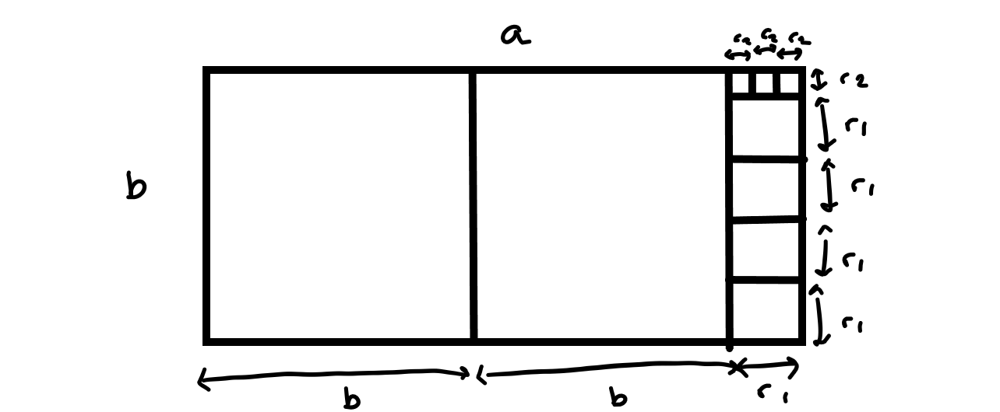
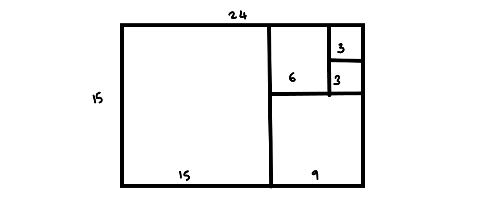

# Some number theory

## Divisors and prime numbers

Let us recall the definition of divisor and prime numbers

::: {.definition name="divisor"}

Given two natural numbers \(n\) and \(m\) we say \(n\) is a divisor of \(m\) (or \(n|m\)) if there exists \(k \in \mathbb{N}\) such that \(m=n\times k\).

:::

::: {.definition name="prime number"}

While we define divisor it is worth defining a prime number. We call \(p \in \mathbb{N}\) a *prime number* if the only divisors of \(p\) are \(1, p\).

:::

Now we have some new definitions

::: {.definition name="greatest common divisor"}

Given two natural numbers \(n\) and \(m\) a number \(q\) that divides both of them is a common divisor and the largest such number is called the *greatest common divisor* we write \(gcd(n,m)\).

:::

This allows us to write a better definition of coprime

::: {.definition name="coprime"}

If \(gcd(n,m)=1\) then \(n\) and \(m\) are coprime.

:::


::: {.theorem name="division with remainder"}

Suppose that \(a \in \mathbb{Z}, b \in \mathbb{N}-\{0\}\) then there exists \(q \in \mathbb{Z}\) and \(r \in [[b]]\) such that
\[ a =bq+r.  \]

:::

::: {.proof}

If \(b=1\) we just take \(q=a, r=0\) so we can work in the case \(b >1\).

Let us fix \(b\) and prove the result by induction on \(a\). If \(a=1\) then \(a=0\times b+1\). This is the base case.

Now if we assume that there exists \(q,r\) such that \(a-1 = qb +r\) then either \(r \in [[b-1]]\) in which case \(a = qb + (r+1)\) is a solution to our problem, or \(r=b-1\) in which case we write \(a = (q+1)b\).

:::

::: {.example}
How can we find the greatest common divisor of two numbers. One way to do it is by repeated division.

We can apply repeated division with \(81\) and \(51\). We have
\begin{align*}
81 & = 1 \times 51 + 30,\\
51 & = 1 \times 30 + 21,\\
30 & = 1 \times 21 + 9,\\
21 & = 2 \times 9 + 3,\\
9 & = 3 \times 3.
\end{align*}

We can also do this backwards to get
\begin{align*}
9 & = 3 \times 3,\\
21 & = 2 \times 9 + 3 = (2 \times 3 +1) \times 3 = 7 \times 3,\\
30 & = 1 \times 21 + 9 = (1 \times 7 + 3) \times 3 = 10 \times 3,\\
51 & = (1 \times  10 + 7) \times 3 = 17 \times 3,\\
81 & = (1 \times 17 + 10) \times 3 = 27 \times 3.
\end{align*}

And we deduce from the that \(gcd(81,51) = 3\).

Why does this work? We notice that if \(c|a, c|b\) then if \(a=qb+r\) then we must have that \(c|r\). Continuing on if \(c|b\) and \(c|r\) and \(b=q_2 r+ r_2\) then \(c|r_2\) and so on. If eventually you end up with a remainder term which is 0 then we terminate. This shoes that if we terminate with remainder \(r_k\) then \(r_k|a\) and \(r_k| b\) and that nothing larger than \(r_k\) can divide both \(a\) and \(b\).

:::

## Euclid's Algorithm

Taking inspiration from calculations like the one above we can write down a procedure to find the greatest common divisor of \(a,b\).

::: {.definition name="Euclid's Algorithm"}
Given \(a, b \in \mathbb{N}\) with \(a < b\) we can write
\begin{align*}
b &= q_1a + r_1, \quad q_1 \in \mathbb{N}, r_1 \in [[a]],\\
a &= q_2r_1 + r_2, \quad q_2 \in \mathbb{N}, r_2 \in [[r_1]],\\
r_1 &= q_3r_2 + r_3, \quad q_3 \in \mathbb{N}, r_3 \in [[r_2]],\\
r_2 & = \dots
\end{align*}
Eventually this process will terminate because we will have \(r_k = 0\) for some \(k\) and then we have \(r_{k-1} = gcd(a,b)\).
:::

::: {.theorem name="Euclid's Algorithm"}
Given the algorithm above we have the following
 - This algorithm will terminate. i.e. eventually we have \(r_{k-1} = q_{k+1} r_{k} + 0\).
 - In this case \(r_{k} = gcd(a,b)\)
 - There exists \(x,y \in \mathbb{Z}\) such that \(gcd(a,b) = xa+by\).
:::

::: {.proof}

We take each point in turn.

Firstly we can see that, for every \(j\), \(r_j> r_{j+1} > r_{j+2} \) so eventually we must get to 0. Therefore the sequence terminates.

Secondly, we prove this by showing that in each step of the algorithm we preserve the set of common divisors. If \(m|r_j\) and \(m|r_{j+1}\) then since \(r_j = q_{j+2}r_{j+1} + r_{j+2}\) so \(m|r_{j+2}\) as well. Equally if \(n|r_{j+1}\) and \(n|r_{j+2}\) then we must have \(n|r_j\) as well. So the set of divisors of \(r_j, r_{j+1}\) is the same as the set of divisors of \(r_{j+1},r_{j+2}\). From this it follows that \(gcd(r_j,r_{j+1})=gcd(r_{j+1},r_{j+2})\). Therefore itterating backwards we have that for every \(j\) that \(gcd(r_j, r_{j+1}) = gcd(a,b)\). Consequently at the point where the algorithm terminates, \(r_k = gcd(r_k,0)=gcd(r_k,r_{k+1})=gcd(a,b)\).

For the last point let us make the claim: For every \(j\) we can write \(r_j = x_j a + y_j b\) for some \(x_j, y_j \in \mathbb{Z}\). Then we can prove this recursively. First we know that \(b=q_1 a + r_1\) so \(r_1 = -q_1 a + 1*b\). Now suppose that \(r_{j-1}, r_{j-2}\) can be expressed as above. We know \(r_{j-2} = q_j r_{j-1} + r_j\) so \(r_j = r_{j-2} - q_j r_{j-1} = x_{j-2} a + y_{j-2} b - q_j(x_{j-1}a + y_{j-1}b) = (x_{j-2}-q_j x_{j-1})a + (y_{j-2} - q_j y_{j-1})b\). So this shows the claim by induction. Now the claim implied in particular that \(r_k = x_k a + y_k b\) proving the third point in the theorem.

:::

### Geometric interpretation of Euclid's algorithm

We can think of this algorithm pictorially by drawing a rectangle of length \(a\) and height \(b\) and then \(q_1\) squares of side length \(b\) inside it leaving a rectangle of length \(r_1\) and height \(b\) and so on...

```{r echo=FALSE, fig.cap="Picture showing Euclid's algorithm pictorially"}

```

Here is a specific example with the numbers \(24\) and \(15\)

```{r echo=FALSE, fig.cap="Picture showing Euclid's algorithm pictorially for 24 and 15"}

```
### Continued fractions

Another way of looking at Euclid's algorithm is continued fractions. If \(a = qb+r\) then 
\[ \frac{a}{b} = q + \frac{r}{b}.  \]
If \(b = q_2 r + r_2\) then
\[  \frac{b}{r} = q_2 + \frac{r_2}{r},\] so
\[ \frac{a}{b} = q + \frac{1}{q_2 + \frac{r_2}{r}}.  \]
Continuing on like this we can express
\[ \frac{a}{b} = q + \frac{1}{q_2 + \frac{1}{q_3 + \dots}}.  \]

In a similar way if we take some real number \(x\) we can write it in continued fraction form by writing \(q_1 = [x]\) and \(q_2 = [1/(x-[x])]\) and so on. Unlike when expressing a rational number this process might not terminate. 

In both situations we call this the continued fraction representation of a number.

### Bezout's lemma

The final statement in Euclid's algorithm is called Bezout's lemma

::: {.lemma name="Bezout's Lemma"}

If \(a,b\) are two natural numbers then there exists \(x,y \in \mathbb{Z}\) such that 
\[ gcd(a,b) = x a + b c.  \]

As a result of this if \(a,b\) are coprime and \(n\) is any integer then there exists \(x, y \in \mathbb{Z}\) such that
\[ n = xa + yb.\]

:::

::: {.proof}

We have already proved the first part in the discussion of Euclid's algorithm.

For the second if \(a,b\) are coprime then \(gcd(a,b) =1\) (this is the definition of being coprime). Then by the first part of the theorem there exists \(\tilde{x}, \tilde{y} \in \mathbb{Z}\) such that 
\[ 1= \tilde{x}a + \tilde{y}b,  \] using this
\[ n = (n\tilde{x})a + (n \tilde{y})b.  \]

:::

Using this we can show a powerful result which we have already seen

::: {theorem}

Suppose that \(a,b \in \mathbb{N}\) and \(p\) is a prime number and \(p|ab\) then either \(p|a\) or \(p|b\).

:::

::: {proof}

If \(p|a\) then we are done so suppose that \(p\) does not divide \(a\). Then \(a,p\) are coprime so by Bezout's lemma we can write
\[1 = xa + yp\] and hence
\[b = xab + ypb.  \] As \(p|ab\) we know \(p|xab\) and from the expression we can see that \(p|ypb\) so \(p | (xab + ybp)\) so \(p|b\).

:::

Now let us use this to prove the fundamental theorem of arithmetic again. Everything is a bit smoother now with more results.

::: {.theorem name="Fundamental Theorem of Arithmetic"}

Any natural number \(n\) has a unique factorisation into prime numbers.

:::

::: {.proof}

First let us use strong induction to prove that there is a prime factorisation. The base case is \(n=2\) which is already in prime factorisation. Now suppose that every number less than \(n\) can be written as a product of prime factors. Then either \(n\) is prime, so it is in prime factorisation or \(n=ab\) then \(a,b < n\) so they have prime factorisations which allows us to write a prime factorisation for \(n\).

Second we want to prove this factorisation is unique. Suppose \(n = p_1 p_2 \dots p_k = q_1 q_2 \dots q_j\) where all the \(p_i, q_i\) are primes. Then \(p_1 | n\) so \(p_1|q_1\) or \(p_1 |q_2\dots q_j\). In the first case we must have \(p_1=q_1\) since \(q_1\) is prime. In the second case we have \(p_1|q_2\) or \(p_1 |q_3 \dots q_j\) and so on. We can keep itterating to show that \(p_1\) must appear in the list \(q_1, \dots q_j\). We can then repeat this with all the \(p_i\).

:::

## Chinese remainder theorem

::: {.theorem name="Chinese Remainder Theorem"}

Suppose that \(n_1, \dots, n_k\) are pairwise coprime integers and \(a_1, \dots, a_k\) are integers with \(a_i \in [[n_i]]\) for every \(i\). Then there exists an integer \(x\) with 
\[ x \equiv a_i \quad \mbox{mod} n_i, \quad i = 1, \dots, k.  \]

:::

::: {.proof}

Let \(m_i = \Pi_{j \neq i} n_j\). Then \(n_i\) and \(m_i\) are coprime so by Euclid's algorithm there exists \(x_i,y_i\) such that \(1 = x_i n_i + y_i m_i\) so \( e_i =y_i m_i = 1- x_i n_i\) so \(e_i \equiv 1 \quad \mbox{mod} \, n_i\) and \(e_i \equiv 0 \quad \mbox{mod} \, n_j\). 

Then let \(x = \sum_{i=1}^k a_i e_i\) then this satisfies the conditions of the theorem. 


:::


::: {.remark}

The Chinese remainder theorem is very old. It dates back to Sunzi in the 3rd to 5th Century. It can be used to do apparently complicated computations very quickly and is used in important algorithms today such as RSA cryptography and Fast Fourier transform.

:::

## Fermat's Little Theorem and Euler's Theorem

::: {.definition}

A number \(a\) is called a emph{unit} modulo \(n\) if there exists \(b\) such that \(ab = 1 \quad \mbox{mod} \, n\). (We call \(b\) a multiplicative inverse modulo \(n\).)

:::

::: {.lemma}

A number \(a\) is a unite modulo \(n\) if and only if \(a\) and \(n\) are coprime.

:::

::: {.proof}

If \(a\) and \(n\) are coprime then \(1 = xa + yn\) in which case \(xa\equiv 1 \quad \mbox{mod} \, n\).

If there exists \(x\) such that \(xa \equiv 1 \quad \mbox{mod} \, n\) then \(x a = 1 + y n \) and \(gcd(a,n) | (xa-yn) \) so \(gcd(a,n) = 1\).

:::


::: {.definition "Euler Totient Function"}

The Euler Totient function \(\phi(n)\) counts the number of natural numbers smaller than \(n\) that are coprime to \(n\). Alternatively the number of units modulo \(n\).

:::

::: {.lemma}

If \(p\) is prime then \(\phi(p) = p-1\).

:::

::: {.example}

Another example is \(n=12\) the numbers smaller than \(n\) which are coprime are \(1,5,7,11\) so \(\phi(12)=4\)

:::

::: {.proposition}

If \(p\) is prime and \(a\) is not a multiple of \(p\) then
\[ a^{p-1} \equiv 1 \quad \mbox{mod} \, p.  \]

:::

::: {.proof}

Let us consider \(a, 2a, 3a, \dots, (p-1)a \) as elements in \(\mathbb{Z}/p\mathbb{Z}\). We claim that they are all distinct. This is because since \(a,p\) are coprime, there exists \(x\) such that \(xa =1\) modulo \(p\). So if \(ka \equiv ja \quad, \mbox{mod} \,p\) then \(kab \equiv jab \quad \mbox{mod} \, p\) so \(k \equiv j \quad \mbox{mod}\, p\). So if \(k, j \in [[p]]\) this would imply \(k = j\).

So \(a, 2a, \dots, (p-1)a\) considered modulo \(p\) must be \(1, 2, \dots, (p-1) \) in some order. Hence
\[ a \times 2a \times \dots \times (p-1)a \equiv (p-1)! \quad \mbox{mod}\, p. \] Which rewriting is
\[ a^{p-1} (p-1)! \equiv (p-1)! \quad \mbox{mod} \, p. \] Now \( (p-1)!\) is coprime to \(p\) since \(p\) is prime. So there exists \(c\) such that \( c(p-1)! \equiv 1 \quad \mbox{mod}\, p\) hence multiplying the equation above by \(c\) we get
\[ a^{p-1} \equiv 1 \quad \mbox{mod} \, p.  \]

:::

::: {.theorem name="Fermat's Little Theorem}

Suppose that \(gcd(a,n) =1\) then \(a^{\phi(n)-1} \equiv 1 \quad \mbox{mod} \, n\).

:::

::: {.proof}

The proof is very similar to above so I will leave the details to you!

Consider the set of integers \{ka\} where \(gcd(k,n) =1\) and \(k \in [[n]]\) and multiply them all together. 

:::
